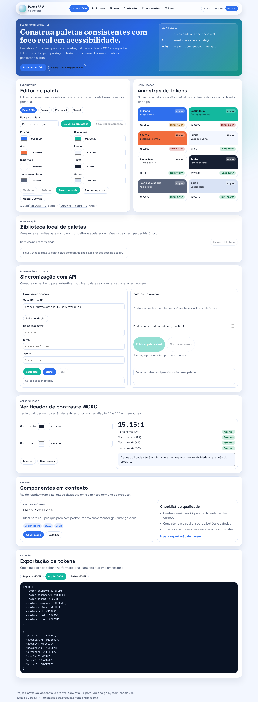

# Paleta de Cores ARIA



## Visao geral
O **Paleta de Cores ARIA** e um studio fullstack para operacao de paletas de cor em ambiente profissional.
Ele integra criacao visual, auditoria de acessibilidade, biblioteca local e sincronizacao com API segura.

Publico-alvo:
- Designers que precisam validar contraste e consistencia visual com rapidez.
- Desenvolvedores que precisam de tokens confiaveis para handoff e implementacao.
- Times de produto que operam com fluxo continuo entre exploracao, validacao e publicacao.

## Proposta de valor
- Reduz retrabalho entre design e engenharia.
- Antecipacao de falhas de contraste antes de publicar em producao.
- Padronizacao de tokens para escalar design system.
- Fluxo de distribuicao local + nuvem com autenticacao e governanca.

## Tecnologias utilizadas
### Frontend
- HTML5 sem frameworks
- CSS3 com design tokens e layout responsivo
- JavaScript ES2020+

### Backend
- Node.js 20+
- Express 4
- Zod (validacao de contrato)

### Seguranca e observabilidade
- JWT (access + refresh)
- `bcryptjs`
- `helmet`, `hpp`, `cors`, `express-rate-limit`
- `pino` e `pino-http` para logs estruturados

### Testes
- `node:test`
- `supertest`

## Funcionalidades principais
### Laboratorio de paleta
- Edicao de 8 tokens centrais (`primary`, `secondary`, `accent`, `background`, `surface`, `text`, `muted`, `border`)
- Presets iniciais e geracao de harmonia automatica
- Undo/redo com historico local
- Exportacao de tokens em CSS e JSON
- Importacao de tokens via JSON

### Acessibilidade e auditoria
- Checker WCAG (AA/AAA) em tempo real
- **Auditoria inteligente da paleta atual** com score 0-100 e grade
- Relatorio em JSON copiavel para documentacao tecnica

### Biblioteca local
- Persistencia de paletas no `localStorage`
- Atualizacao e exclusao de versoes
- **Favoritos locais** para curadoria rapida
- Filtro dedicado (`Todas` / `Favoritas`)

### Integracao com API
- Cadastro, login, refresh, logout e perfil
- Publicacao de paleta atual
- Sincronizacao de paletas em nuvem
- Compartilhamento publico via link (`shareId`)

## API backend (resumo)
Base local padrao: `http://localhost:3333`

### Health
- `GET /api/v1/health/live`
- `GET /api/v1/health/ready`
- `GET /api/v1/health/info`
- `GET /api/v1/health/metrics` (role `admin`)
- `GET /api/v1/docs/openapi.json`

### Auth
- `POST /api/v1/auth/register`
- `POST /api/v1/auth/login`
- `POST /api/v1/auth/refresh`
- `POST /api/v1/auth/logout`
- `POST /api/v1/auth/logout-all`
- `GET /api/v1/auth/me`
- `POST /api/v1/auth/change-password`

### Palettes
- `GET /api/v1/palettes/public/:shareId`
- `GET /api/v1/palettes/public/:shareId/audit`
- `GET /api/v1/palettes`
  - Query params suportados: `limit`, `offset`, `search`, `visibility`, `tags`, `sortBy`, `sortDir`
- `POST /api/v1/palettes`
- `POST /api/v1/palettes/import`
- `GET /api/v1/palettes/:paletteId`
- `GET /api/v1/palettes/:paletteId/audit`
- `PATCH /api/v1/palettes/:paletteId`
- `DELETE /api/v1/palettes/:paletteId`
- `POST /api/v1/palettes/:paletteId/share`
- `POST /api/v1/palettes/:paletteId/unshare`
- `GET /api/v1/palettes/analytics/summary`

## Melhorias tecnicas implementadas nesta versao
- Escrita **atomica** no banco em arquivo (`FileDatabase`) para reduzir risco de corrupcao.
- Endpoint de **auditoria de paleta** (privado e publico) com score, checks e recomendacoes.
- Listagem de paletas com filtros/ordenacao para cenarios de escala.
- Frontend com biblioteca local com favoritos e painel de auditoria visual.
- Refactor completo de UI/UX com nova hierarquia visual, responsividade e foco em clareza.

## Instalacao e uso
### Pre-requisitos
- Node.js 20+
- npm 10+

### Instalar dependencias
```bash
npm install
npm --prefix backend install
```

### Rodar frontend (preview)
```bash
npm run preview
```
Frontend: `http://localhost:4173`

### Rodar backend
```bash
npm --prefix backend run dev
```
Backend: `http://localhost:3333`

### Executar testes
```bash
npm test
```

## Variaveis de ambiente
Use `backend/.env.example` como base.

Campos relevantes:
- `PORT`
- `JWT_ACCESS_SECRET`
- `JWT_REFRESH_SECRET`
- `CORS_ORIGIN`
- `DATA_FILE`
- `ADMIN_BOOTSTRAP_EMAIL`
- `RATE_LIMIT_WINDOW_MS`
- `RATE_LIMIT_MAX`
- `AUTH_LOGIN_RATE_LIMIT_WINDOW_MS`
- `AUTH_LOGIN_RATE_LIMIT_MAX`

## Estrutura do projeto
```text
.
├─ assets/
│  ├─ css/styles.css
│  └─ js/app.js
├─ backend/
│  ├─ data/database.json
│  ├─ docs/openapi.json
│  ├─ src/
│  │  ├─ application/
│  │  ├─ config/
│  │  ├─ domain/
│  │  ├─ infrastructure/
│  │  ├─ interfaces/http/
│  │  ├─ utils/
│  │  ├─ app.js
│  │  └─ server.js
│  ├─ tests/
│  └─ package.json
├─ docs/preview.png
├─ index.html
├─ package.json
└─ README.md
```

## Boas praticas adotadas
- Separacao clara de responsabilidades por camadas no backend.
- Validacao de entrada com schemas (`zod`) antes da regra de negocio.
- Tratamento consistente de erros com codigos padronizados.
- Seguranca de sessao com rotacao de refresh token e revogacao de sessoes.
- Interface responsiva com foco em fluxo de trabalho e legibilidade.
- Testes automatizados para fluxos criticos de auth, health e palettes.

## Possiveis melhorias futuras
- Migrar persistencia para PostgreSQL (indices, transacoes e auditoria historica).
- Suporte a workspaces multi-tenant e colaboracao em equipe.
- Pipeline de quality gates com testes e2e de frontend.
- Exportacao para formatos adicionais de design token (Style Dictionary, Tailwind, Figma).
- Dashboard de observabilidade com metricas e tracing em tempo real.

---

Autoria: Matheus Siqueira  
Website: https://www.matheussiqueira.dev/
